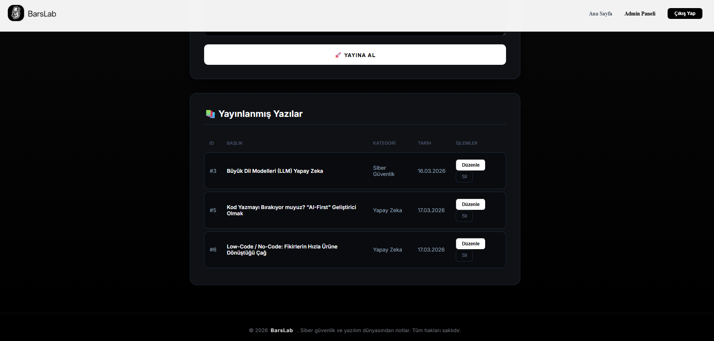

🛡️ Full-Stack Yazılım ve Teknoloji Blogu

Bu proje, modern web teknolojileriyle geliştirilmiş, yazılım, teknoloji ve güncel konular üzerine blog yazılarının ve teknik makalelerin paylaşılabileceği, okuyucu odaklı bir platformdur. Bir bilgisayar mühendisliği öğrencisi olarak, modern yazılım geliştirme prensiplerini ve güvenlik standartlarını uygulayarak geliştirdiğim bu sistem, bilgi paylaşımını merkeze almaktadır.

🚀 Proje Hakkında

Bu platform, yazarların içeriklerini kolayca yönetebileceği ve okurların akıcı bir okuma deneyimi yaşayabileceği dinamik bir altyapı sunar. Sadece kişisel bir vitrin olmanın ötesinde; arka planda güçlü güvenlik önlemlerinin (JWT, CORS, Secure Config) alındığı, ön yüzde ise içerik tüketiminin ve kullanıcı deneyiminin ön planda tutulduğu, makale paylaşımına özel olarak optimize edilmiş bir sistemdir.

✨ Temel Özellikler

🔐 Gelişmiş Kimlik Doğrulama: JWT (JSON Web Token) altyapısı ile kurgulanmış, içerik üreticileri ve yöneticiler için güvenli giriş ve yetkilendirme sistemi.

📱 Okuyucu Odaklı Responsive Tasarım: Masaüstü, tablet ve mobil cihazlarda kesintisiz ve göz yormayan bir okuma deneyimi sunan modern "Premium Dark" tema.

🏗️ N-Tier Architecture: Backend tarafında temiz kod prensiplerine uygun, sürdürülebilir ve esnek katmanlı mimari.

📑 Kapsamlı Makale Yönetimi: Yazıları kategorilendirme, zengin içerik oluşturma, tam kapsamlı CRUD (Ekle/Oku/Güncelle/Sil) işlemleri ve medya (resim) desteği.

🛡️ Güvenli Yapılandırma: Hassas veritabanı bilgilerinin ve gizli anahtarların appsettings.json üzerinden güvenli konfigürasyon yöntemleriyle yönetimi.

---

## 🛠️ Teknik Stack

### **Backend**
- **Framework:** .NET 8 Web API
- **ORM:** Entity Framework Core (Code First)
- **Veritabanı:** MSSQL (Microsoft SQL Server)
- **Güvenlik:** JWT Bearer Authentication, CORS Policy
- **Dokümantasyon:** Swagger UI

### **Frontend**
- **Kütüphane:** React 18
- **Build Tool:** Vite
- **Styling:** CSS3 (Custom Modern Properties)
- **HTTP Client:** Axios

  ## 📸 Ekran Görüntüleri

<p align="center">
  <br>
  <b>Ana Sayfa</b><br>
  <br>
  
  <br><br>
  <br>
  
  <b>Blog Detay Sayfası</b><br>
  <br>
  
  <br><br>

  <b>Giriş Paneli</b><br>
  <br>
  
  <br><br>

  <b>Admin Yönetim Paneli</b><br>
  <br>
  

   <br><br>

  <b>Admin Delete & Update</b><br>
  <br>
  
  
</p>

Proje Ekran Kaydı = https://www.loom.com/share/84840a65f71b4dd599c220c84047667f
---

Geliştiren: **Çağatay Ok**

## 📂 Proje Yapısı

```text
BarsLab/
├── MyBlogProject/          # ASP.NET Core Web API (Backend)
│   ├── Controllers/        # API Uç noktaları
│   ├── Context/            # Veritabanı Bağlamı (EF Core)
│   ├── Models/             # Veritabanı Nesneleri
│   └── appsettings.json    # Yapılandırma ve Bağlantı Bilgileri
│
└── my-blog-frontend/       # React Uygulaması (Frontend)
    ├── src/
    │   ├── components/     # Navbar, Footer vb.
    │   ├── pages/          # Login, Home, Admin Sayfaları
    │   └── assets/         # Logolar ve Görseller
    └── index.html          # Ana HTML dosyası

---
