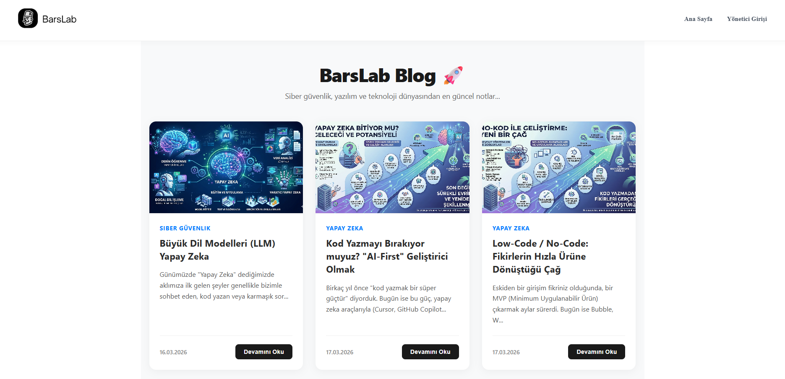
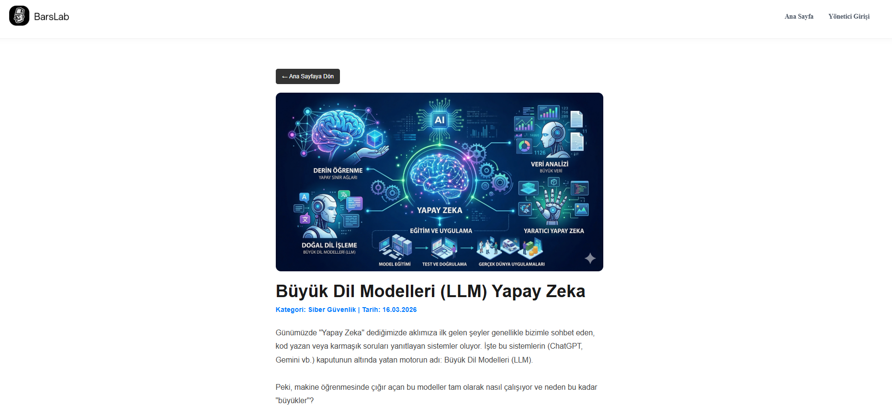
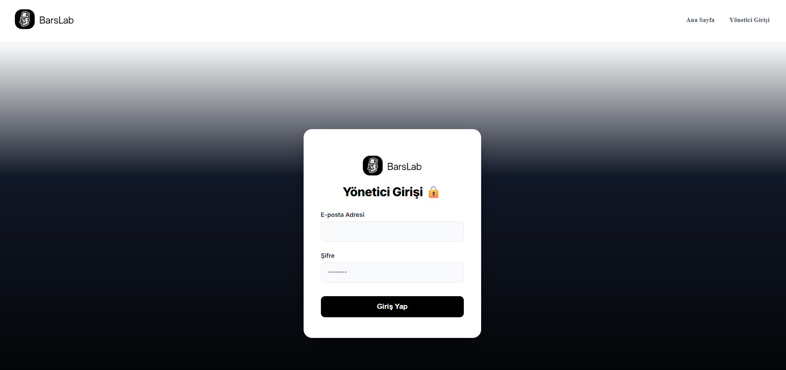
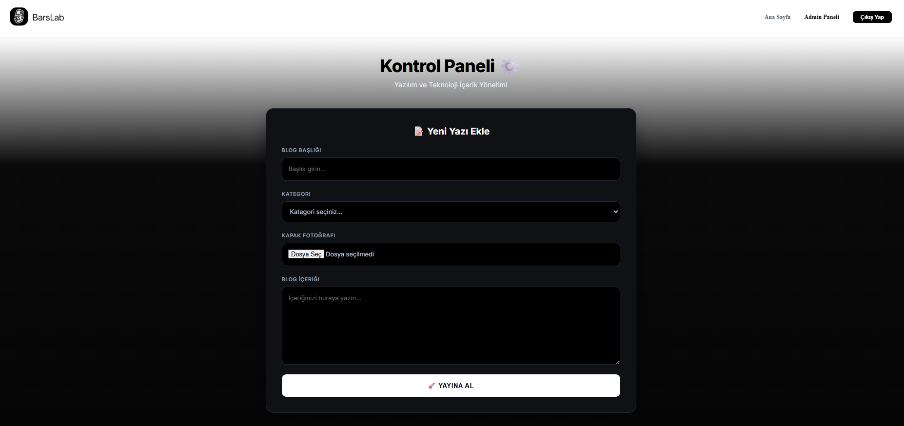

# 🛡️ BarsLab - Full Stack Yazılım Blogu

BarsLab, modern web teknolojileriyle geliştirilmiş, yazılım ve teknoloji odaklı içeriklerin paylaşılabileceği, güvenliği ön planda tutan bir Full-Stack blog platformudur. Bu proje, bir **Bilgisayar Mühendisliği** öğrencisinin yazılım geliştirme ve güvenlik standartlarını bir araya getirme sürecini temsil eder.

---

## 🚀 Proje Hakkında
BarsLab, sadece bir içerik yönetim sistemi değil, aynı zamanda siber güvenlik prensiplerinin (JWT, CORS, Secure Config) uygulandığı bir "Portfolio Project"tir. Yönetici paneli üzerinden içerik yönetimi sağlanırken, kullanıcı tarafında hızlı ve duyarlı (responsive) bir arayüz sunar.

### ✨ Temel Özellikler
- **🔐 Gelişmiş Kimlik Doğrulama:** JWT (JSON Web Token) kullanılarak güvenli giriş ve yetkilendirme sistemi.
- **📱 Responsive Tasarım:** Masaüstü ve mobil cihazlarla tam uyumlu "Premium Dark" tema.
- **🏗️ N-Tier Architecture:** Backend tarafında temiz ve sürdürülebilir katmanlı yapı.
- **📑 Dinamik Blog Yönetimi:** Kategorilendirme, CRUD (Ekle/Oku/Güncelle/Sil) işlemleri ve resim desteği.
- **🛡️ Güvenli Yapılandırma:** Veritabanı bağlantı bilgilerinin ve gizli anahtarların `appsettings.json` üzerinden güvenli yönetimi.

---

## 🛠️ Teknik Stack

### **Backend**
- **Framework:** .NET 8 Web API
- **ORM:** Entity Framework Core (Code First)
- **Veritabanı:** MSSQL (Microsoft SQL Server)
- **Güvenlik:** JWT Bearer Authentication, CORS Policy
- **Dokümantasyon:** Swagger UI

### **Frontend**
- **Kütüphane:** React 18
- **Build Tool:** Vite
- **Styling:** CSS3 (Custom Modern Properties)
- **HTTP Client:** Axios

---

## 📂 Proje Yapısı

```text
BarsLab/
├── MyBlogProject/          # ASP.NET Core Web API (Backend)
│   ├── Controllers/        # API Uç noktaları
│   ├── Context/            # Veritabanı Bağlamı (EF Core)
│   ├── Models/             # Veritabanı Nesneleri
│   └── appsettings.json    # Yapılandırma ve Bağlantı Bilgileri
│
└── my-blog-frontend/       # React Uygulaması (Frontend)
    ├── src/
    │   ├── components/     # Navbar, Footer vb.
    │   ├── pages/          # Login, Home, Admin Sayfaları
    │   └── assets/         # Logolar ve Görseller
    └── index.html          # Ana HTML dosyası

---

## 📸 Ekran Görüntüleri

<div align="center">
  <h3>Ana Sayfa </h3>
  
  
  <br>

  <h3>Blog Detay </h3>
  
  
  <br>

  <h3>Giriş Paneli </h3>
  

  <br>

  <h3>Admin Yönetim Paneli</h3>
  
</div>

---
